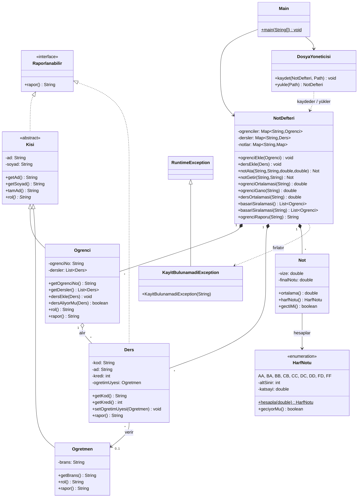

# Öğrenci Not Takip Sistemi

KYZ205 Nesne Tabanlı Programlama dersi grup projesi.
Öğrencilerin ders notlarını kaydeden, ağırlıklı ortalama ve harf notu hesaplayan,
sınıf ortalaması ile başarı sıralaması raporlayan ve verileri dosyaya kaydeden
konsol tabanlı bir Java uygulaması.

## Ekip

| Üye | Roller |
|-----|--------|
| Kamer Kaan Şahin | GitHub Sorumlusu, Tasarım Sorumlusu |
| [Ad Soyad 2] | Dokümantasyon Sorumlusu, Test/Kalite Sorumlusu |

## Özellikler

- Öğrenci kaydı (numara, ad, soyad)
- Ders tanımlama (kod, ad, kredi, öğretim üyesi)
- Öğrenciye ders ve not atama (vize %40, final %60)
- Ortalama, harf notu (AA–FF) ve geçme durumu hesaplama
- Kredi ağırlıklı genel ortalama ve GANO (4'lük sistem)
- Ders bazlı sınıf ortalaması
- Genel ve ders bazlı başarı sıralaması
- Verileri metin dosyasına kaydetme ve geri yükleme
- Hatalı girişlerde (0–100 dışı not, mükerrer kayıt, olmayan öğrenci) anlamlı hata mesajları

## Kullanılan OOP İlkeleri

| İlke | Nerede |
|------|--------|
| **Soyut sınıf ve kalıtım** | `Kisi` (abstract) → `Ogrenci`, `Ogretmen` |
| **Arayüz** | `Raporlanabilir` → `Kisi`, `Ders` tarafından uygulanır |
| **Çok biçimlilik** | `Kisi.rol()` ve `Raporlanabilir.rapor()` her alt sınıfta farklı davranır |
| **Kapsülleme** | Tüm alanlar `private`, erişim getter/setter ile; `Not` sınıfı 0–100 doğrulaması yapar |
| **Koleksiyonlar** | `NotDefteri` içinde `HashMap`, `LinkedHashMap`, `ArrayList` |
| **Enum** | `HarfNotu` harf notlarını ve katsayıları tutar |
| **Dosya G/Ç** | `DosyaYoneticisi` ile `java.nio.file` üzerinden kaydet/yükle |
| **Özel istisna** | `KayitBulunamadiException` |

## UML Sınıf Diyagramı



PlantUML kaynağı: [docs/uml.puml](docs/uml.puml)

## Proje Yapısı

```
kyz205-proje-grup-4/
├── pom.xml                       Maven yapılandırması (JUnit 5)
├── mvnw, mvnw.cmd, .mvn/         Maven Wrapper (Maven kurulumu gerektirmez)
├── calistir.cmd                  Maven olmadan derle + çalıştır (Windows)
├── ornek-veri.txt                Örnek veri dosyası (menü 10 ile yüklenir)
├── README.md
├── docs/
│   ├── uml.puml                  UML sınıf diyagramı (PlantUML)
│   ├── GOREV_DAGILIMI.md         Roller ve haftalık plan
│   ├── GITHUB_ADIMLARI.md        Branch / commit / PR rehberi
│   └── RAPOR_TASLAGI.md          Proje raporu şablonu
└── src/
    ├── main/java/com/kyz205/nottakip/
    │   ├── Main.java                         Konsol menüsü
    │   ├── model/
    │   │   ├── Raporlanabilir.java           Arayüz
    │   │   ├── Kisi.java                     Soyut sınıf
    │   │   ├── Ogrenci.java
    │   │   ├── Ogretmen.java
    │   │   ├── Ders.java
    │   │   ├── Not.java
    │   │   └── HarfNotu.java                 Enum
    │   └── service/
    │       ├── NotDefteri.java               Koleksiyon yönetimi ve hesaplar
    │       ├── DosyaYoneticisi.java          Dosya G/Ç
    │       └── KayitBulunamadiException.java
    └── test/java/com/kyz205/nottakip/
        ├── model/NotTest.java
        ├── model/HarfNotuTest.java
        ├── service/NotDefteriTest.java
        └── service/DosyaYoneticisiTest.java
```

## Kurulum ve Çalıştırma

### Gereksinimler

- Java 17 veya üzeri (JDK). Maven kurmak **gerekmez**: projedeki Maven Wrapper
  (`mvnw.cmd` / `mvnw`) ilk çalıştırmada Maven 3.9.9'u otomatik indirir.

### Maven Wrapper ile

Windows'ta `mvnw.cmd`, Linux/macOS'ta `./mvnw` kullanın:

```bash
mvnw.cmd clean test     # testleri çalıştır
mvnw.cmd exec:java      # uygulamayı başlat
mvnw.cmd package        # çalıştırılabilir JAR üret -> target/ogrenci-not-takip-1.0.0.jar
java -jar target/ogrenci-not-takip-1.0.0.jar
```

### Maven olmadan (Windows)

```bash
calistir.cmd
```

Bu script `javac` ile derler ve `java` ile çalıştırır. Türkçe karakterlerin
doğru görünmesi için konsol kod sayfasını UTF-8 yapar.

### Örnek veri

`ornek-veri.txt` dosyası 3 ders, 3 öğrenci ve 7 not içerir. Menüden **10** seçip
dosya yolu olarak `ornek-veri.txt` yazarak yükleyebilirsiniz.

## Kullanım Kılavuzu

Program açıldığında numaralı bir menü görünür:

```
=== Öğrenci Not Takip Sistemi ===

1) Öğrenci ekle
2) Öğretim üyesi ile ders ekle
3) Not ata (vize/final)
4) Öğrenci raporu
5) Ders sınıf ortalaması
6) Genel başarı sıralaması
7) Ders bazlı başarı sıralaması
8) Öğrenci ve ders listesi
9) Dosyaya kaydet
10) Dosyadan yükle
11) Örnek verileri yükle
0) Çıkış
Seçiminiz:
```

Hızlı deneme için **11** ile örnek verileri yükleyin, sonra **6** ile sıralamayı görün.

### Örnek akış

1. `2` → Ders ekle: `KYZ205`, `Nesne Tabanlı Programlama`, kredi `4`, öğretim üyesi `Ayşe Yılmaz`, branş `Bilgisayar`
2. `1` → Öğrenci ekle: `2024001`, `Ali`, `Demir`
3. `3` → Not ata: öğrenci `2024001`, ders `KYZ205`, vize `85`, final `90`
4. `4` → Öğrenci raporu: `2024001`

```
=== 2024001 - Ali Demir (1 ders) ===
KYZ205   Nesne Tabanlı Programlama      Vize:  85.0  Final:  90.0  Ortalama:  88.00  Harf: BA
Genel Ortalama: 88.00   GANO: 3.50
```

5. `9` → Dosyaya kaydet (varsayılan `notdefteri.txt`)

### Not hesaplama kuralları

| Kural | Değer |
|-------|-------|
| Ortalama | vize × 0.40 + final × 0.60 |
| Harf notu | AA ≥ 90, BA ≥ 85, BB ≥ 80, CB ≥ 75, CC ≥ 70, DC ≥ 65, DD ≥ 60, FD ≥ 50, FF < 50 |
| Geçme | DD ve üzeri |
| Genel ortalama | Derslerin kredi ağırlıklı ortalaması |
| GANO | Harf katsayılarının kredi ağırlıklı ortalaması (AA = 4.0 ... FF = 0.0) |

### Veri dosyası biçimi

Her satır bir kayıt, alanlar `;` ile ayrılır. `#` ile başlayan satırlar yorumdur.

```
DERS;KYZ205;Nesne Tabanlı Programlama;4;Ayşe;Yılmaz;Bilgisayar Mühendisliği
OGRENCI;2024001;Ali;Demir
NOT;2024001;KYZ205;85.0;90.0
```

## Testler

JUnit 5 ile yazılmış 20 birim testi bulunur:

| Test sınıfı | Kapsam |
|-------------|--------|
| `NotTest` | Ağırlıklı ortalama, harf notu, geçme durumu, 0–100 doğrulaması |
| `HarfNotuTest` | Harf sınırları ve katsayılar |
| `NotDefteriTest` | Not atama, mükerrer kayıt, sınıf ortalaması, kredi ağırlıklı ortalama, sıralama |
| `DosyaYoneticisiTest` | Kaydet/yükle döngüsü, hatalı dosya |

```bash
mvnw.cmd test
```

## Şartname Karşılığı

| Gereksinim | Durum |
|------------|-------|
| En az 3 sınıf | 10 sınıf + 1 arayüz + 1 enum |
| En az 1 kalıtım veya arayüz | `Kisi` kalıtımı ve `Raporlanabilir` arayüzü |
| Koleksiyon veya dosya G/Ç | Her ikisi: `HashMap`/`ArrayList` ve `DosyaYoneticisi` |
| UML sınıf diyagramı | Yukarıda (Mermaid) ve `docs/uml.puml` |
| En az 3 birim testi | 20 test |
| README.md | Bu dosya |
| GitHub reposu | `kyz205-proje-grup-4` |
